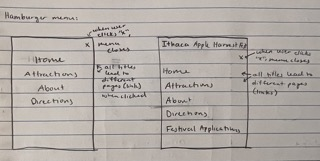
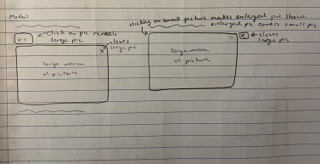
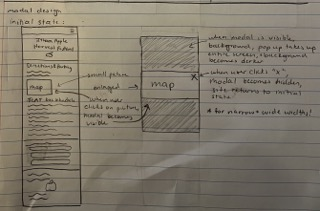
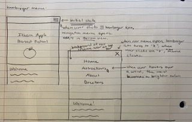
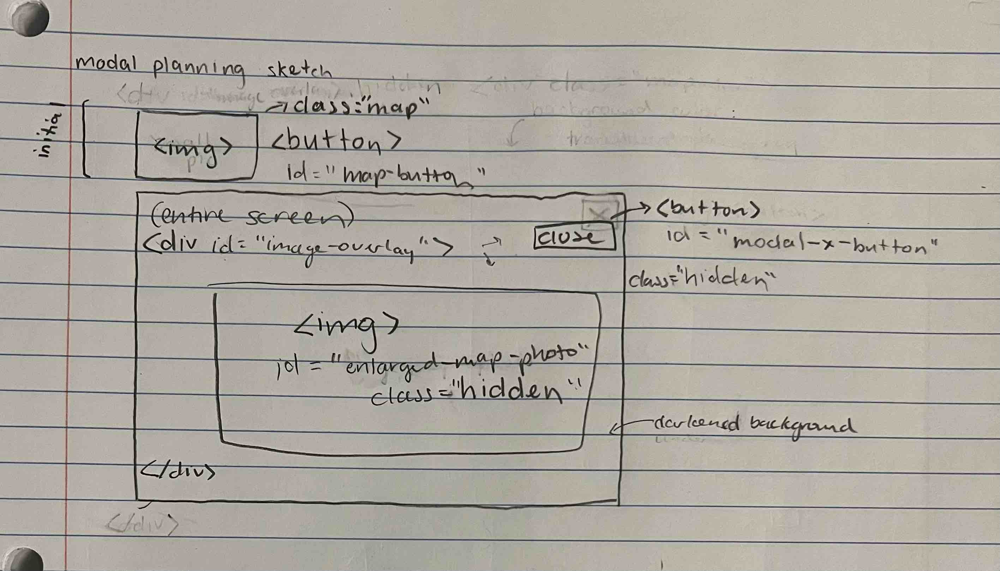
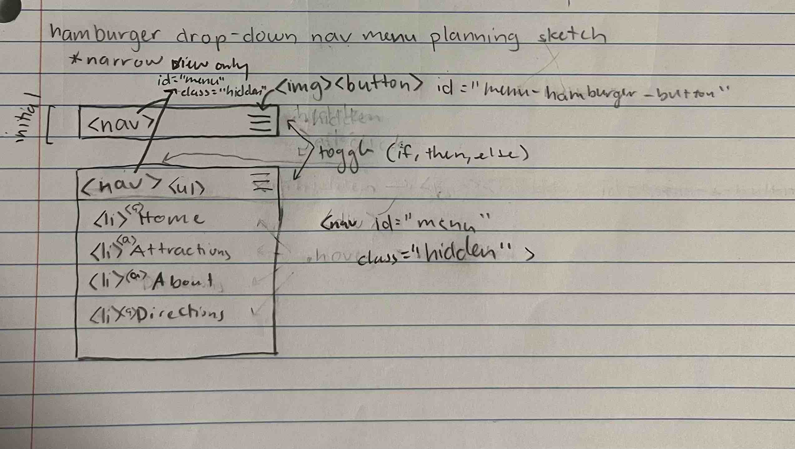

# Project 3: Design Journey

**For each milestone, complete only the sections that are labeled with that milestone.** Refine all sections before the final submission.

You are graded on your design process. If you later need to update your plan, **do not delete the original plan, leave it in place and append your new plan _below_ the original.** Then explain why you are changing your plan. Any time you update your plan, you're documenting your design process!

**Replace ALL _TODOs_ with your work.** (There should be no TODOs in the final submission.)

Be clear and concise in your writing. Bullets points are encouraged.

Place all design journey images inside the "design-plan" folder and then link them in Markdown so that they are visible in Markdown Preview.

**Everything, including images, must be visible in _Markdown: Open Preview_.** If it's not visible in the Markdown preview, then we can't grade it. We also can't give you partial credit either. **Please make sure your design journey should is easy to read for the grader;** in Markdown preview the question _and_ answer should have a blank line between them.


## Existing Project (Milestone 1)

**Tell us about the project you'll be using for Project 3.**

### Project (Milestone 1)
> Which project will you add interactivity to enhance the site's functionality?

Project 2


### Audience (Milestone 1)
> Briefly explain your site's audience. (1-2 sentences)
> Be specific and justify why this audience is a **cohesive** group.

The site's audience is made up of the people attending the Ithaca Apple Harvest Festival, which means residents of Ithaca and surrounding areas, and students from Cornell University and Ithaca College.


### Audience's Goals (Milestone 1)
> List the audience's goals that you identified in Project 1 or 2.
> Simply list each goal. No need to include the "Design Ideas and Choices", etc.
> You may adjust the goals if necessary.

- Learn about the overall environment of Apple Fest
- Learn information on what will be at the festival
- Directions to the festival
- Becoming a volunteer/vendor


## Interactivity Design (Milestone 1)

### Modal Interactivity Brainstorm (Milestone 1)
> Using the audience goals you identified, brainstorm possible options for **modal** interactivity to enhance the functionality of the site while also assisting the audience with their goals.
> Briefly explain each idea and provide a brief rationale for how the interactivity enhances the site's functionality for the audience. (1 sentence)
> Note: You may find it easier to sketch for brainstorming. That's fine too. Do whatever you need to do to explore your ideas.

- I'm going to include a hamburger menu for my website. This will enhance the site's functionality by organizing and condensing the site's pages.
- On the directions page, there's a map of the festival. I'm going to have a modal that allows the user to view the map on a larger scale, thus enhancing the functionality of the site by making it easier to read the details of the map. Additionally, the audience will be able to more easily achieve their goal of learning how to get to the festival.

### Interactivity Design Ideation (Milestone 1)
> Explore the possible design solutions for the interactivity.
> Sketch at least two iterations of the modal and at least two iterations of the hamburger menu interactivity.
> Annotate each sketch explaining what happens when a user takes an action. (e.g. When user clicks this, something else appears).


Modal Design Ideas



Hamburger Menu Design Ideas



### Final Interactivity Design Sketches (Milestone 1)
> Create _polished_ sketch(es) (it's still a sketch, but with a little more care taken to communicate ideas clearly to the graders) to plan your interactivity.
> **Sketch out the entire page where your interactivity will go.**
> Include your interactivity to the sketch(es).
> Add annotations to explain what happens when the user takes an action.
> Include as many sketches as necessary to communicate your design (ask yourself, could another 1300 take these sketches an implement my design?)

**Modal design sketches:**



**Hamburger drop-down navigation menu design sketches:**




### Interactivity Rationale (Milestone 1)
> Describe the purpose of your proposed interactivity.
> Provide a brief rationale explaining how your proposed interactivity addresses the goals of your site's audience.
> This should be about a paragraph. (2-4 sentences)

The interactivity I plan on including on my Ithaca Apple Harvest Festival website will provide my audience with a comfortable and easy way to use the website. The hamburger menu included on narrow view widths of the website will make navigating the website much easier. There will be a menu displayed by a hamburger icon in the top right corner of the page that users can click on to show the whole menu. This makes the website more organized and appealing to the audience's eye. In addition, the modal for the map will make using the website much more comfortable for the audience. It will increase the size of the modal so that the audience can easily view all routes and directions for getting to the apple fest. This directly addresses the goals of my site's audience because it helps them more comfortably and conveniently reaching their goal of learning how to get to the apple festival.


## Interactivity Implementation Plan (Milestone 1)

### Interactivity Planning Sketches (Milestone 1)
> Produce planning sketches that include all the details another 1300 student would need to implement your interactivity design.
> Your planning sketches should include _all_ HTML elements needed for the interactivity; _annotations_ for the element types, their unique IDs, and CSS classes; and lastly the initial CSS classes.

**Modal planning sketches:**



**Hamburger drop-down navigation menu planning sketches:**



^^new answer. Old answer: (modal-planning-sketch.jpg) Wrong screenshot included

### Interactivity Pseudocode Plan (Milestone 1)
> Write your interactivity pseudocode plan here.
> Pseudocode is not JavaScript. Do not put JavaScript code here.

**Modal pseudocode:**

Open the modal:

```
when #map-button is clicked
    remove .hidden from #enlarged-map-photo
    add .hidden to #map-button
    remove .hidden #modal-x-button
```

Close the modal:

```
when #modal-x-button is clicked
    add .hidden to #enlarged-map-photo
    add .hidden to #modal-x-button
    remove .hidden from map-button
```

**Hamburger menu pseudocode:**

Pseudocode to show/hide (toggle) the navigation menu (narrow screens):

```
When #menu-hamburger-button is clicked
    If #menu has class .hidden
        remove .hidden from #menu
    Else
        add .hidden from #menu
```

Pseudocode to hide the hamburger button and show the navigation bar when the window is resized too wide:

```
If the website width >700px
    add .hidden to #menu-hamburger-button
    remove .hidden from #menu
```

Pseudocode to show the hamburger button and hide the navigation menu when the window is resized too narrow:

```
If the website width <700px
    remove .hidden from #menu-hamburger-button
    add .hidden to #menu
```


## Grading (Final Submission)

### Interactivity Usability Justification (Final Submission)
> Explain how your design effectively uses affordances, visibility, feedback, and familiarity.
> Write a paragraph (3-5 sentences)

My design effectively uses affordances because for example, when hovering over any button on the website, the cursor changes to be a pointer. This is a familiar design choice that most users will be expecting, therefore making my website effectively use familiarity. In addition, all of the buttons also look like typical buttons that you'd find on a website. Moreover, my website successfully uses feedback by changing what the user sees when they complete an action. For example, when the user clicks the hamburger menu button in a narrow screen, the website provides immediate feedback and reveals the dropdown menu. Additionally, the website uses visibility to help the user by making actions visible only when the user wants them to be visible. For example, not all content will be shown at all times. If all content was being shown on the screen at all times, it would make for a very confusing website that's hard to navigate.


### Tell Us What to Grade (Final Submission)
> We aren't re-grading your Project 1 or 2.
> We are only grading the interactivity you added.
> Tell us where (what pages) we can find your interactivity and how to use it.
> **We will only grade what you list here;** if it's not listed, we won't grade it.

In a narrow screen view only, there is interactivity on all of the pages at the top of the page for the navigation menu. The menu is represented by a hamburger icon in the top right corner. When you click on the icon, the navigation drop-down menu becomes visible and lets you go to the other pages. When you click on the icon again, the drop-down menu goes away. When you hover over the button, the cursor becomes a pointer to indicate that it's a button.

On the directions page, there is a map on how to navigate the festival. When you click on the map, a modal of the map becomes visible. The background becomes dark, the interactivity reveals a large picture of the map, and a "close" button appears in the top right to close the modal. The small map on the page is a button that makes the cursor a pointer when hovering over the button to indicate to the user that the picture is interactive.

When hovering over certain items on the sidebar on all pages, the buttons change to a different color. Additionally, when hovering over certain items on the home page, they change to light blue. These interactivity elements indicate to the users that the links work and provides them with feedback.


### Collaborators (Final Submission)
> List any persons you collaborated with on this project.

I got help from TAs during office hours.


### Reference Resources (Final Submission)
> Please cite any external resources you referenced in the creation of your project.
> (i.e. W3Schools, StackOverflow, Mozilla, etc.)

I used Mozilla, W3Schools, and StackOverflow.


### Self-Reflection (Final Submission)
> This was the first project in this class where you coded some JavaScript. What did you learn from this experience?

During this project, I learned to be patient, thoughtful, and detail-oriented. There is no "validator" for Java like there is for HTML or CSS, so it's very important to pay extremely close attention to any possible errors.


> Take some time here to reflect on how much you've learned since you started this class. It's often easy to ignore our own progress. Take a moment and think about your accomplishments in this class. Hopefully you'll recognize that you've accomplished a lot and that you should be very proud of those accomplishments!

From not knowing one thing about coding, to knowing how to use HTML, CSS, and JavaScript, and designing and coding interactive websites, I've made so much progress in one semester. I've accomplished so much in this class so far and I'm so glad I decided to take this class!
